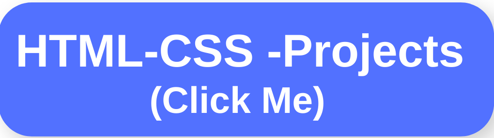

 

## :wave: Hi there, I'm Mustafa

 :heavy_check_mark: I'm a Front-End Developer. 
 
:fireworks: Exploring routes to new visions and be a part of the new visions. 
 
 :😊: A new age enthusiast. 
 
:coffee: Coffee is how I keep up with code

## :man::woman: Connect with me:

 

 

<h2 align="center">:rocket:Technical Skills</h2>

 

 

 
<!--
 
-->
 <h2> ## :star2: My Projects: <h2/>

 

<h2 align="center">My Top Projects</h2>

###

Project Demo       |Libraries and Technologies I use     |Project Preview
:-------------------------|-------------------------|-------------------------
[my-mui-project](my-mui-project.vercel.app/) <h3>[Repo](https://github.com/mbozkayaGitHub/my-mui-project)</h3> | React-MUI | ]

 
<h2 align="center">:bulb:Most Used Language</h2>

        
 
        
    
  

(333 kB)
